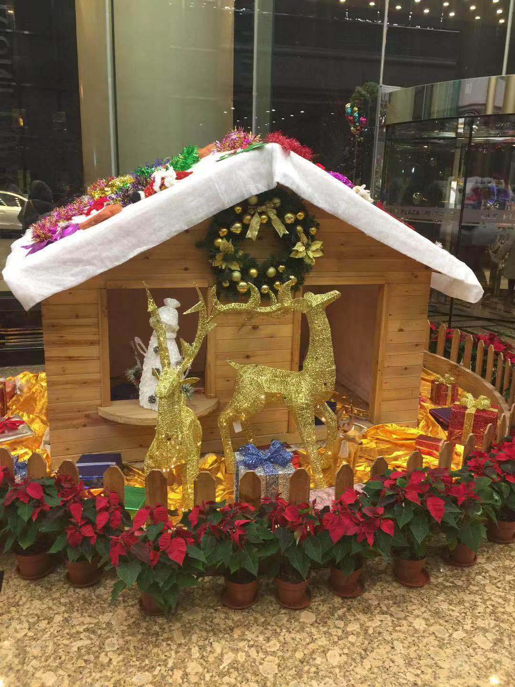
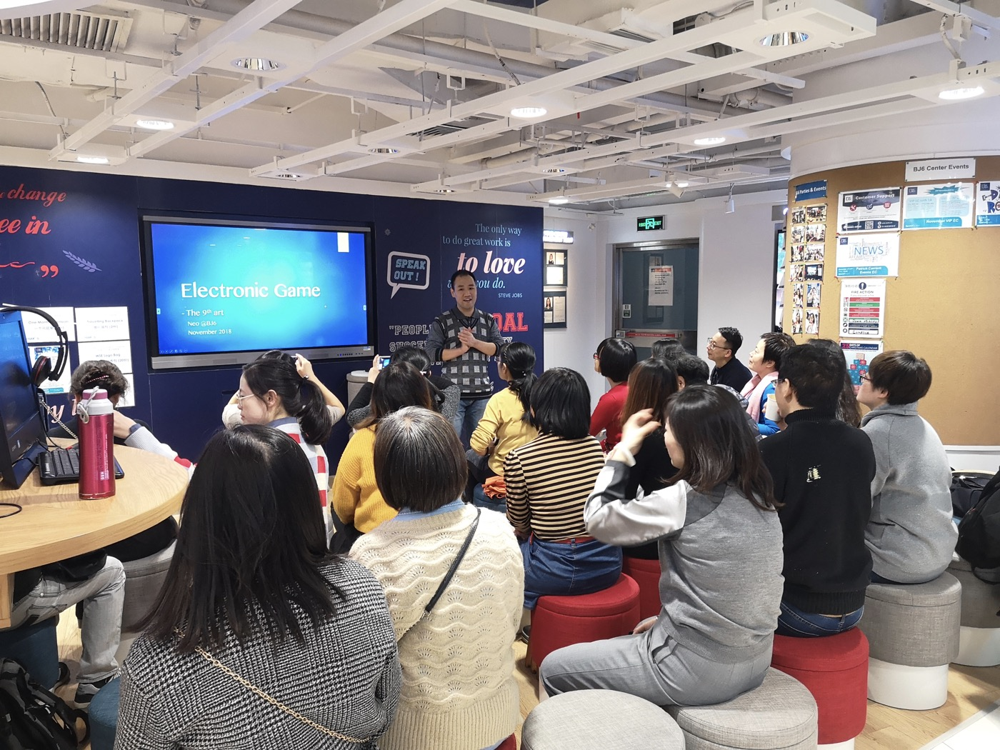
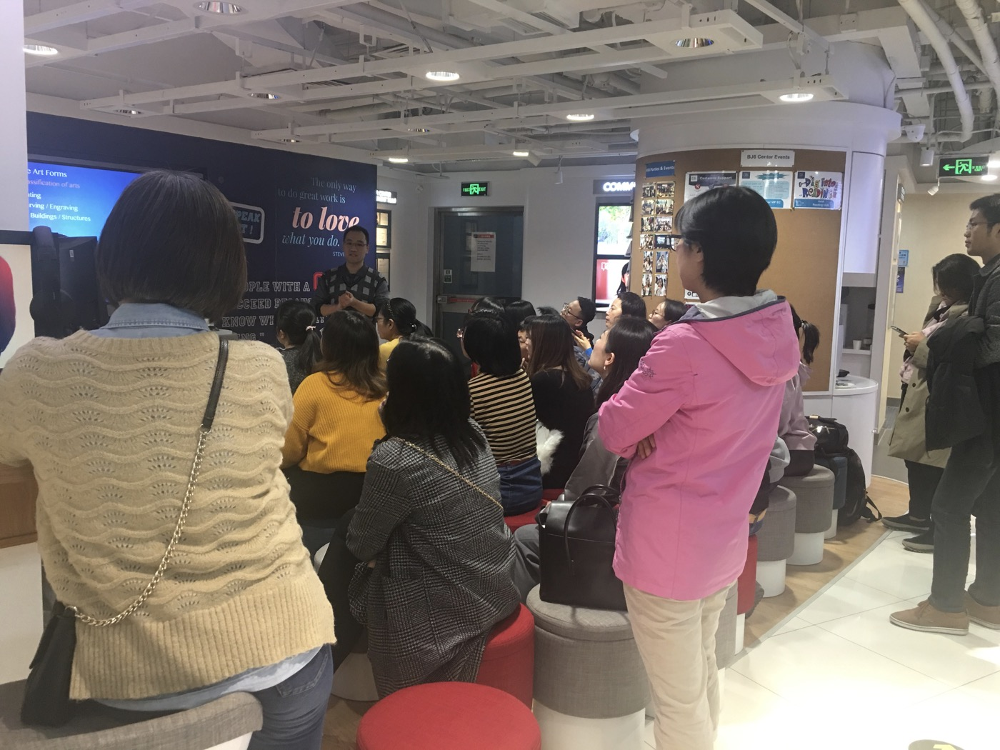

[点击这里去微信公众号阅读本文](https://mp.weixin.qq.com/s/Itb2esLpPMj2it4KKUNJDg)

又到了一年一度总结（打脸）以及立新Flag等着来年继续被打脸的时刻了。

其实本篇是有点标题党的，因为我没打算在这一篇中对我的2018年做一个完整详尽的总结，而只打算整理回顾一下，这一年在业余时间自己学习、收获了什么。

其实在上大学期间，我是一直有写日记的习惯的，是真的用笔在本上写的日记，不是任何的电子文档。而这个习惯随着毕业，随着开始陀螺一般转个不停的职业生涯，随着在网上写Blog的流行，让我给丢掉了。

期间虽有总结，但并未落实为正式的文字。这不好。

用李笑来”七年就是一辈子“的理念来衡量，到2018年末，我将要离开大学“两辈子”了。这是个略显特殊的时间结点，适合用来打脸反思，规划展望。而我也越来越真正的认识到，做好记录的重要性。所以，开始吧。

--- 这里开始是正文 ---

#### 1. 工作和职业

这一年工作有收获，但从未来职业发展的角度来说，远不及预期。

并且对工作了“两辈子”的我来说，到了某种意义上的关键节点。

从2012年（职业生涯第二辈子的起点）开始，到今天正好又是七年。不断探索，修正，期间有妥协权衡，也有执着果断，不过未来“我到哪去？”，仍然是个需要研究的问题。这是个很大的话题，不在此赘述，值得以后单独的篇章。

#### 2. 生活

柴米油盐酱醋茶就不写了。唯一的终身大事，无果，打脸。

希望明年能有更多的琴棋书画诗酒茶。

--- 这里开始才是真正的正文 ---

#### 3. 读书、学习和成长

1. 2017年底  — 2018年1月：
   
   完成有道精品课： 李俊超Max 《美语纠音室》，规范了自己的美语发音。

2. 2018年1月 — 4月：
   
   完成有道精品课： Elise 《完美英音进化论》，系统学习了标准英音（Received Pronunciation），同时也更清楚了英音和美音的区别，纠正了很多不准确不正确不地道的发音，经过练习初步可以在两种发音风格之间切换。

3. 2018年4月日 — 2018年04月21日：
   
   完成有道学习营： Elise 《21天英音蜕变营·第三期》，进一步刻意练习了标准英音。但因自己多年来基本以美音为标准，英音仍不熟练。

4. 2018年5月9日  — 至今：
   
   学习 Wall Street English 的英语课程合同第二期，Level.18 - Level.20，目前已达到最高级 Level 20，第二单元进行中。这项几乎占据了我近三年绝大部分的业余时间，不过我相信长期来看，回报也将是巨大的。

5. 2018年12月11日  — 至今：
   
   学习 Wall Street English 的英语课程：Harvard ManageMentor（哈佛管理大师课），完成一节。
   
   ---

6. 2018年5月 — 9月：
   
   完成得到专栏学习： 《王烁大学问》，124讲。

7. 2018年5月 — 至今：
   
   得到课程学习： 李笑来《通往财富自由之路》，完成 77%，252讲。

8. 2018年5月 — 至今：
   
   得到专栏阅读： 《吴军·硅谷来信》，完成 66%， 249篇。

9. 2018/09/13：
   
   完成得到课程： 《薛毅然·怎样找准你的职业路线》。

10. 2018/12/06：
    
    完成得到课程：王立铭《科学前沿课：众病之王的解决方案》。
    
    ---

11. 2018年7月 — 9月：
    
    读完李笑来的4本书：
    
    《新生 —— 七年就是一辈子》 
    
    《把时间当作朋友》 
    
    《人人都能用英语》 
    
    《挤挤都会有的》 

12. 2018年10月10日 — 至今：
    
    尤瓦尔·赫拉利 简史三部曲，《今日简史》，《未来简史》，《人类简史》，开了个头，未完成。
    
    ---

13. 2018年11月22日 — 2018年11月30日：
    
    经过一周左右的准备，11月30日周五晚上七点，在 Wall Street English BJ6 海淀黄庄中心，首次自己主持（其实是讲）了一次英语角，主题：Electronic Games，79页PPT，1小时40分。
    
    前面的学习都是在输入，这次是输出，全程英文，也算是对自己三年来在华尔街英语学习的一个阶段性检验。
    
    
    
    得到两个教训：
    
    一是PPT做多了，且没有彩排临场发挥，时间太长了。虽然没有严格时间限制，但时间是宝贵的，过久会占用会让听众不耐烦，尤其是对话题不是那么感兴趣的听众；
    
    二是面对公众讲话，听众的背景知识差异需要格外关注，信息传递和接受本身都会有损失，所以你以为你浅显的讲清楚了，但实际上总有人领会到的是另外的意思。
    
    

**以上即为主要业余时间换来的所得，有些完成了，有些仍在进行中，2019我们继续。**

**And last but not the least, Merry Christmas and Happy New Year!**

【END】
