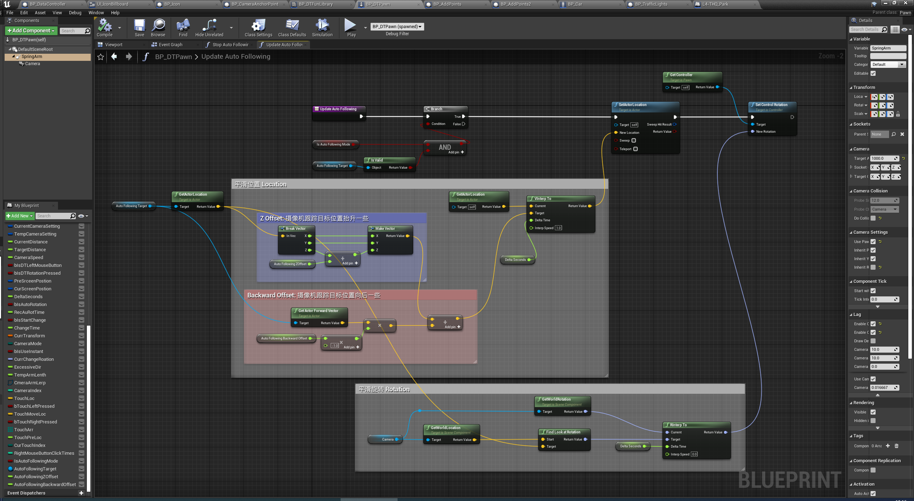

[点击这里到微信公众号阅读本文](https://mp.weixin.qq.com/s/8lM6HcrvClkmefWnKtlPYw)

我们在玩3D的赛车游戏或者第三人称动作、射击游戏时，对跟在角色或控制的车辆后面的摄像机画面的平滑运动已经很熟悉了，那么，我们自己如何写代码做出类似的效果呢？

从算法的原理上分析，我们要做的其实只有两点：

1. 在每一帧更新时取得要跟随的目标的位置向量（Position），假如目标不动，这就是我们想要把摄像机（最终）移动到的位置，然后通过计算插值得出实际在这一帧要把摄像机移动到的位置；
2. 在每一帧更新时取得要跟随的目标的旋转向量（Rotation），假如目标不动，这就是我们想要摄像机（最终）看向的方向，然后通过计算插值得出实际在这一帧摄像机要看向的方向；

在 Unity 中，可以将类似下面的代码挂在摄像机上即可：

```C#
using System.Collections;
using System.Collections.Generic;
using UnityEngine;

public class SmoothFollow : MonoBehaviour {
    public Transform target;  //这个是要跟随的物体，比如RPG中的主角 或者 赛车游戏中的赛车

    public float height = 3.5f;    //这个是设置摄像机的高度
    public float distance = 7;     //这个是设置摄像机的距离
    public float smoothSpeed = 1;  //这个是平滑移动的速度

    // Use this for initialization
    void Start ()
    {

    }

    // Update is called once per frame
    void Update ()
    {
        Vector3 targetForward = target.forward; 
        targetForward.y = 0;   //以x 和 z 所在平面进行旋转

        Vector3 currentForward = transform.forward;
        currentForward.y = 0;

        Vector3 forward = Vector3.Lerp(currentForward, targetForward, smoothSpeed * Time.deltaTime);

        Vector3 targetPos = target.position + Vector3.up * height - forward * distance;
        this.transform.position = targetPos;
        transform.LookAt(target);
    }
}
```

那么在 UE4 中呢？其实在 UE4 中除了 Lerp() 函数，有三个更好用的函数，可以非常方便的实现这个功能：

1. VInterpTo() : 可以对位置 Location 向量进行平滑插值，并且可以通过 Interp Speed 参数控制平滑到目标的速度，值越大速度越快；
2. RInterpTo() : 可以对旋转 Rotation 向量进行平滑插值，并且可以通过 Interp Speed 参数控制平滑到目标的速度，值越大速度越快；
3. FindLookAtRotation() : 可以给一个 Start Location 向量 和一个 Target Location 向量，然后就可以得出摄像机从 Start 看向 Target 的 Rotation；

所以，使用上面三个函数具体的平滑实现如下图中的蓝图代码（在新页面中打开图片看大图）。 



在这个实现中，Camera 是通过 SpringArm 绑定在主角 Pawn 下的，SpringArm Component 中勾选了“使用 Control Rotation”，这样的话，父对象也就是 Pawn 本身会随着 “Look At Rotation” 来变化，子对象 Camera 也会看向目标，所以通过 GetController -> Set Control Rotation() 设置 RInterpTo() 平滑后的 Rotation 就可以让摄像机看向目标（平滑后的值）。

但是如果直接以目标物体的 Location 和 Rotation 为目标，会发现摄像机总是会降到平视物体并且贴地的视角。为什么呢？
因为 SpringArm 是绑定在父对象Pawn上的的，而父对象Pawn 的 Rotation变化就会让 SpringArm “甩平”，而位置目标又是直接用的跟踪对象（车）的位置，所以就会贴地。解决方法是：不直接用跟踪对象（车）的位置做 位置目标，而是用向上（Z Offset）一些，向后一些的一个位置做位置目标即可。

【END】
