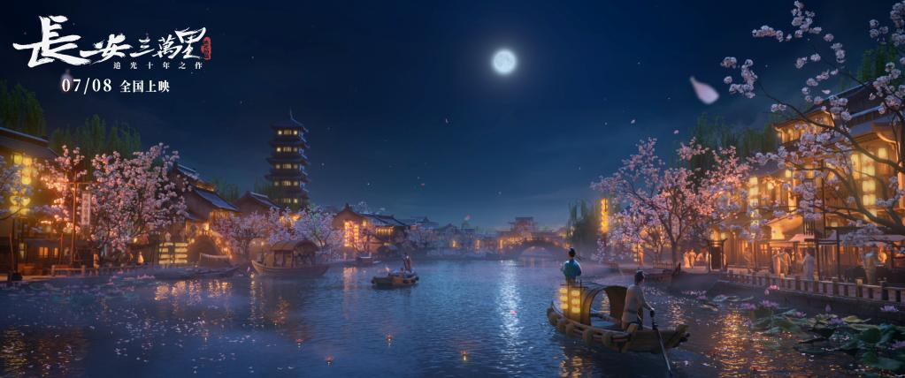
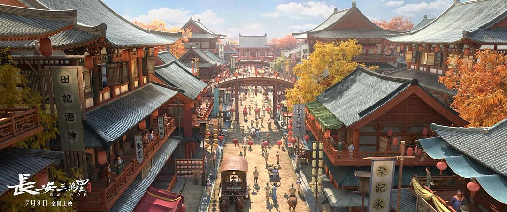

昨天晚上，在2023这个夏天的尾巴还很有威力的时候，偷了个闲抓住电影上映的尾巴去看了《长安三万里》，上次看电影，还是年初的时候在老家县城看的《流浪地球2》。

电影散场后，从盛世长安的繁华和残破不堪的黄鹤楼中走出来，走在盛世北京灯火通明的街道上，陷入沉思。

客观来说，似乎这个片子不值豆瓣上8.3的高分，尤其从讲故事的角度；但主观上，我又觉得还挺好看。

拋开动画和电影产业角度的分析，有几个直观的感受，记录一下。

# 1. 终于有这样的国产动画电影了：画面质量超出预期。

电影开始没多久，我心里的这句话就要蹦出来了：终于有这样的国产动画电影了。

“这样”是什么样？

可以和迪士尼、皮克斯动画电影放在一个维度比较的画面质量；不是炒冷饭把以前拍过无数遍的名著故事又拿来再回锅一遍；有自己想法的讲了一个还不错的故事；不是听着英文对白看着中文字幕，而是听着中文对白看着英文字幕。

这几点基本都达到了。什么？你说背的48首也都是耳熟能详的唐诗，不算炒冷饭？我觉得不是，不接受反驳，Case Closed.（反正我说的是感受。）

说真的，在电影过程中那些熟悉的诗句出来，就是有种恰到好处的震憾。 

# 2. 古来圣贤皆寂寞，人生不如意十之八九。

电影是用高适和李白一生的友谊和人生际遇，串起了整个2小时40分的故事，也串起了大唐的兴衰。

在这过程中，一众我们曾经在高考前背的滚瓜烂熟的名字，杜甫、王维、王昌龄、孟浩然、崔颢、岑参、张旭等等陆续出场，而令人唏嘘的是，他们好像也都找不到（好）工作。

这么多天才也整天觉得怀才不遇，郁郁寡欢，借酒浇愁，而且他们中的大多数人直到最后也没有实现抱负，说不定还是郁郁而终；这些诗人中只有高适郁闷了大半辈子，但最终成就最高。

看来人生不如意十之八九，是有道理的。看来我们总觉得不够幸福生活不够如意也不是意外，自古如此啊。

# 3. 英文字幕翻译是真的好。

另一个直观的感受就是像前面说的，听着中文对白，看着英文字幕。为什么还要看英文字幕？因为实在翻译的太好了。真的做到了信、达、雅。

据说《长安三万里》电影台词的译者是片方邀请的澳大利亚的 sinologist（汉学家）Linda Jaivin 女士，她的汉语名字是贾佩琳。已经深耕中英文化领域四十多年，曾翻译了很多有名的中文影片，比如 ：

•***Farewell My Concubine***《霸王别姬》

•***Forever Enthralled***《梅兰芳》

•***Hero***《英雄》

举几个《长安三万里》中诗句英文字幕翻译的例子：

> 人生得意须尽欢，莫使金樽空对月。
> 
> **When life goes well, be joyous;**
> 
> **Never show the moon an empty cup.**

这个：

> 天生我材必有用，千金散尽还复来。
> 
> **Heaven gave me the talent for a reason;**
> 
> **Spend now, riches return in season.** 

reason和season还完美地押上韵了。

还有这个：

> 古来圣贤皆寂寞，惟有饮者留其名。
> 
> **Ancient sages leave no name;**
> 
> **It’s great drinkers who enjoy great fame.**

# 4. 有些场景是不是有点过于“疯”了。

夸完了，说一点缺点，有些展示饮酒做乐、纸醉金迷的场景在我看来有点夸张了，会有那么一点点太疯了，李白他们不应该是不羈吗，怎么看着还有点放荡了。

# 5. 168分钟的片长是个小挑战，尤其是对小朋友。

另一个小缺点就是，片长对观众来说太长了，对这个故事又太短了。

我看的场次也有挺多家长带小朋友来的，小朋友们都挺听话的，开始一直很安静，但到2小时左右的时候，就有小朋友坚持不住了。这个片子站在小朋友的角度来看，还是太严肃太无趣了吧？何况还这么长……

但整个片子几乎是讲了高适和李白的一生荣辱起伏，在一个时间跨度极大的故事下，实际上整个故事过于松散。很多场景点到了，但不尽兴，缺乏足够的冲突和张力。

最后说一句，我自己来说，还是挺喜欢这个片子的，看的也沉浸。当年上小学中学的时候，要有这样的片子，我的历史也不至于学的一塌糊涂完全提不起兴趣。

而且，就像很多人一样，从小接受唐诗教育的我们，也许不是因为片子本身故事多好看而喜欢，也许只是因为那48首从小耳熟能详的唐诗，终于不再只是躺在书上的文字，而是活生生的场景和人演给我们。

对我而言，还有另一点，比如上图这个画面和片中长安的很多场景，都让我想起了曾经玩过的很多武侠RPG中的长安，记不清是《仙剑奇侠传》还是《轩辕剑》、《剑侠情缘》什么的，但反正，我知道，那是我的青春。

【END】
